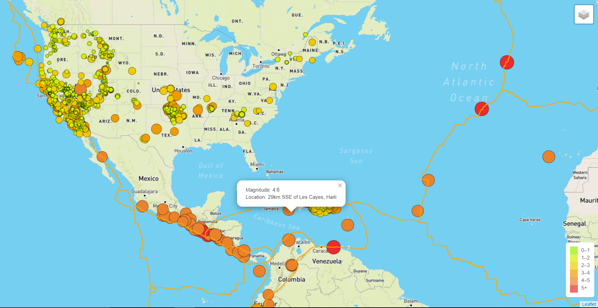
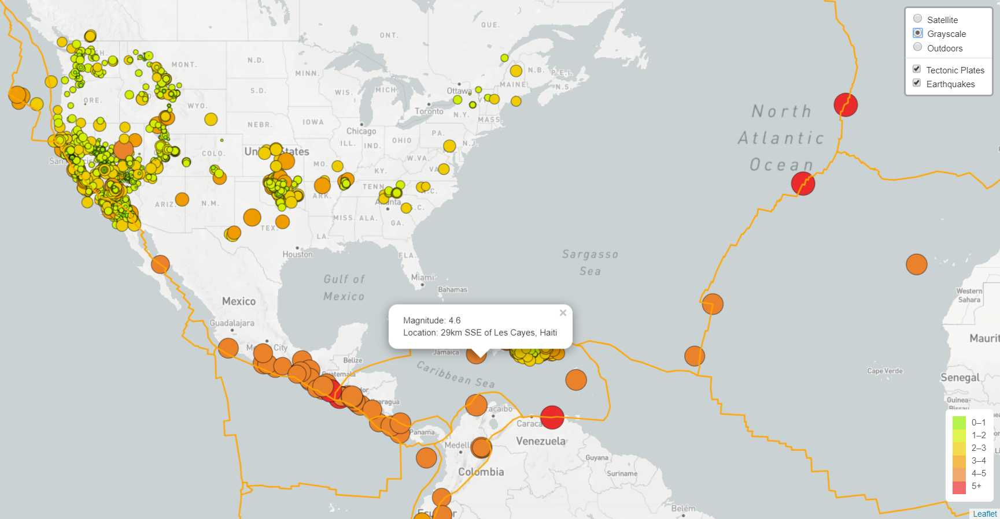
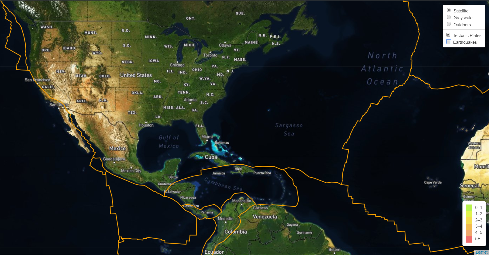

# Leaflet Project - Visualizing Data with Leaflet

Welcome to the United States Geological Survey, or USGS for short! The USGS is responsible for providing scientific data about natural hazards, the health of our ecosystems and environment; and the impacts of climate and land-use change. Their scientists develop new methods and tools to supply timely, relevant, and useful information about the Earth and its processes. As a new hire, you will be helping them out with an exciting new project!

The USGS is interested in building a new set of tools that will allow them visualize their earthquake data. They collect a massive amount of data from all over the world each day, but they lack a meaningful way of displaying it. Their hope is that being able to visualize their data will allow them to better educate the public and other government organizations (and hopefully secure more funding..) on issues facing our planet.

## Data Sources
* Earthquake data [USGS GeoJSON Feed](http://earthquake.usgs.gov/earthquakes/feed/v1.0/geojson.php)
* Tectonic Plates data <https://github.com/fraxen/tectonicplates>

## Earthquakes & Tectonic Plates Visualization

Visualize recent earthquake data over the past 30 days against the location of tectonic plates using Leaflet, javascript, and HTML to render the mapped data:

* Earthquake data markers reflect the magnitude of the earthquake. Earthquakes with higher magnitudes appear larger and darker in color.

   * Click on a marker for additional information about each earthquake

* Note: Use $python -m http.server was used to locally host the webpage

Example images of map:

### Observation

